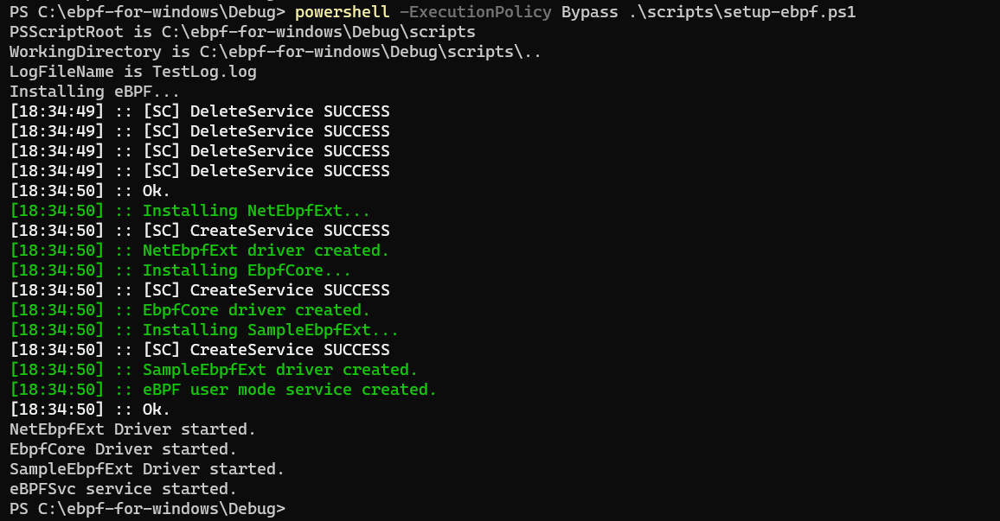

## Configure Test VM:

### Enable test signed binaries:

From within the VM desktop, enable test signed binaries as follows(see [testsigning](https://docs.microsoft.com/en-us/windows-hardware/drivers/install/the-testsigning-boot-configuration-option) for more discussion):

- Start an admin command shell (`cmd.exe`)
- Do `bcdedit.exe -set TESTSIGNING ON`
- Restart the VM so that the change will be applied.

### Installing eBPF into a Test VM:

#### Install a release with the MSI installer

Do the following from within the VM:

1. Download and install the `VC++ Redist` package from this location.
2. Download the `eBPF-for-Windows.x.x.x.msi` file from the latest release on GitHub.
3. Execute the [MSI](https://github.com/microsoft/ebpf-for-windows/releases/download/v0.9.0/ebpf-for-windows.0.9.0.msi) file you downloaded.

See more details [here](https://github.com/microsoft/ebpf-for-windows/blob/main/docs/InstallEbpf.md#method-1-install-a-release-with-the-msi-installer)


#### Now copy desired ebpf programs from the [build](https://github.com/microsoft/ebpf-for-windows/actions/runs/5496110597) package that needs to be attached to the following path:

- eBPF repository artifacts are retrieved by joining the following elements to build the complete path:
    - `https://<ebpf-repo-url>/<ebpf-program>/<version>/<platform>/<artifact>`
    <br>or<br>
    - `file:///<repo-dir>/<ebpf-program>/<version>/<platform>/<artifact>`

> Example: `"C:\var\l3afd\repo\port_quota\debug\port_quota\port_quota.exe"`

### Start eBPF services(in case of JIT mode only):

1. To start the ebpf services if it is not running
```bash
powershell -ExecutionPolicy Bypass .\scripts\setup-ebpf.ps1
```



2. To query the status of the "ebpfcore","ebpfsvc" and "netebpfext" service in Windows. It helps you check whether the service is running, stopped, or in a different state.
```bash
sc query ebpfcore
sc query ebpfsvc
sc query netebpfext
```

3. To manually start/stop any serivce:
```bash
sc <start/stop> <service_name>
```

