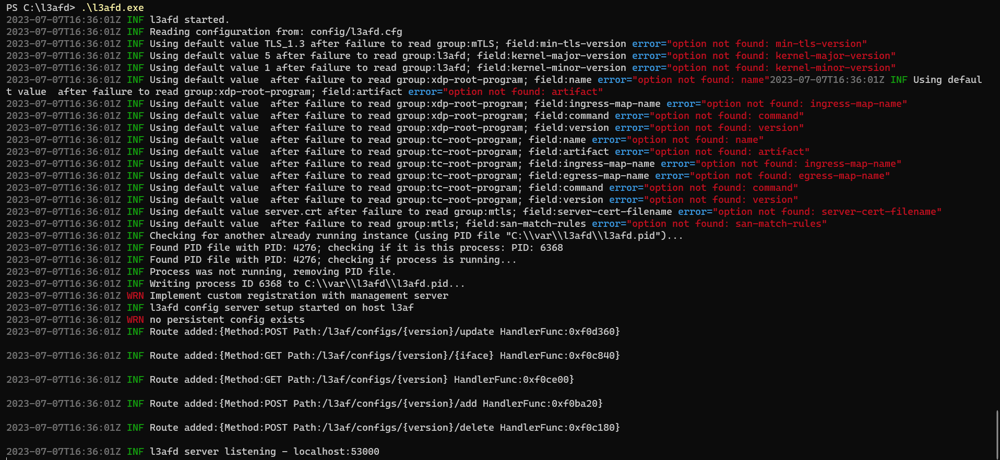
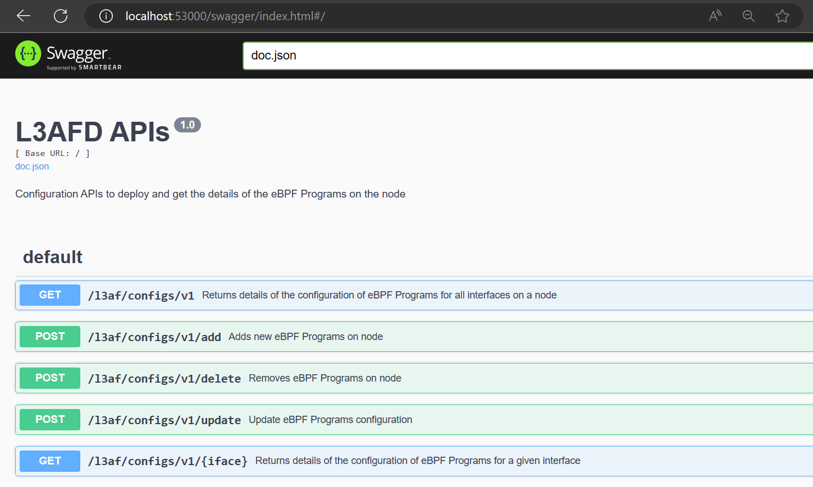
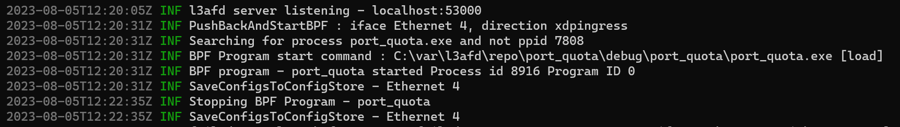

### Prerequisites:

- [Git](https://github.com/git-for-windows/git/releases/download/v2.41.0.windows.3/Git-2.41.0.3-64-bit.exe)
- Cmake
- Clang
- nmake
- [Golang](https://aka.ms/vs/17/release/vs_buildtools.exe)
- C++ using: [MSYS2](https://www.msys2.org/)
- [Visual Studio Build Tools 2022](https://aka.ms/vs/17/release/vs_buildtools.exe)

### Steps to build l3afd on windows:

1. Clone l3afd repo:
```bash
git clone https://github.com/l3af-project/l3afd.git
```

2. Build l3afd using:
```bash
cmake -B build
cmake --build build
```

>l3afd.exe file will be created afte this.

### Steps to run l3afd on widnows:

3. Update [l3afd_win.cfg](../config/l3afd_win.cfg) file:

- Rename the file as `l3afd.cfg`
- Manually create a directory and set the custom path for pid-file: `mkdir C:\var\l3afd`
- Set `swagger-api-enabeled` to **true**

4. Run l3afd.exe
```bash
l3afd.exe
```



### Access Swagger API on dashboard:
Go to this webpage: http://localhost:53000/swagger/index.html



### Attaching eBPF program with L3AF:

> **NOTE:** Before moving further, setup [eBPF-for-windows]() environment on the system.

#### Changes need to be done before proceeding:

Manually set path of following in [l3afd_win.cfg](../config/l3afd_win.cfg):
- bpf-dir:
- bpf-log-dir:
- BpfMapDefaultPath:
- [ebpf-repo] url:
- set bpf-chaining-enabeled to false

#### Using [payload.json](../config/payload.json) to load programs:

- Use this curl command to add an ebpf program using `payload.json` file:
```bash
curl -X POST http://localhost:53000/l3af/configs/v1/add -d "@cfg/payload.json"
```

- See the `logs` in the window where `l3afd.exe` is running:



### Confirm eBPF program loading on Windows:

- Use this cmd to list out all the eBPF programs running on the system:
```bash
netsh ebpf show programs
```


